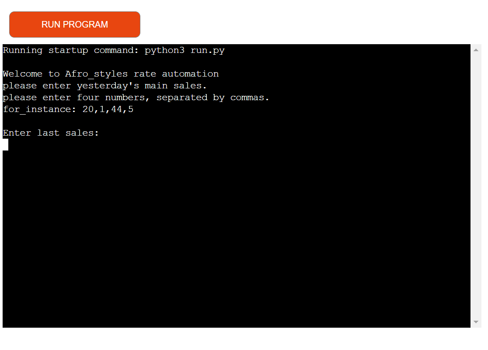
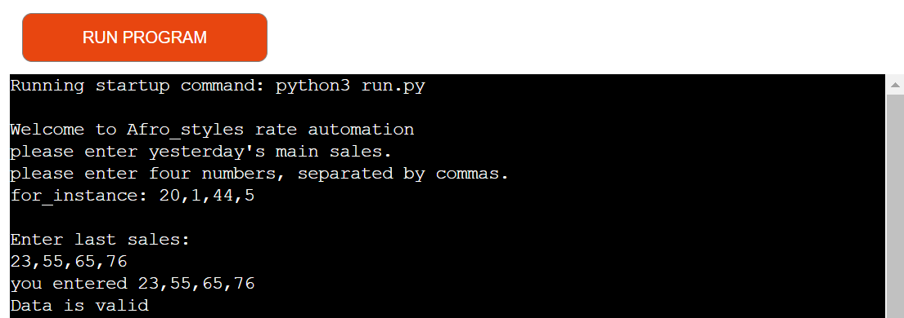

# Afro_Styles - An African Fashion shop automation service.

### Introduction to the project
This project is a simple command line application built with python, designed to automate future sales predictions by using user inputs from the last four markert sales to give recommendations for future products that are bought before sales in other to improve sales by not running out of products or buying too many products. The Afro_styles is an African fashion shop that wants to predict the avarage fashion wears that should be ordered in the future.

[**LIVE SITE**](https://afro-styles-0dfbaac1b245.herokuapp.com/)

[**REPOSITORY**](https://github.com/Adimserious/afro_styles.git)

### Contents
[Introduction to the project](#introduction-to-the-project) 

[User experience (UX)](#user-experience-ux) 

[Target audience](#target-audience)

[User story](#user-story)

[Flow Chart](#flow-chart)

[Features](#features)

[Technologies used](#technologies-used)

[Languages used](#languages-used)

[Software used](#software-used)

[Data model](#data-model)

[Libraries used](#libraries-used)

[Deployment](#deployment)

[Testing](#testing)

[Manual testing](#manual-testing)

[Validator tests](#validator-tests)

[Solved bugs](#solved-bugs)

[Credits](#credits)

[Code used](#code-used)

[Content for the project](#content-for-the-project)

[Learning materials](#learning-materials)

[Acknowledgments](#acknowledgments)

## User experience (UX)

### Target audience
- People who run daily sale
- People who want to make better sale
- Pople who wants to save cost

### User story
As a first time user of the application, you want to:
- understand the simple input instructions 
- input the corret data type
- get predictions in seconds

As a frequent user, you want to:
- You want to keep automating future sales predictions 
- You will be familiar with the input requirements

### Flow Chart

### Features
start screen:
The user is greated with a welcome message followed by the input requirements.

Exactly 4 inputs number(s) are allowed separated by commas.
if numbers are less or more than 4, a value error message will be promped to inform user that 4 numbers are the exact requirements.

if letters are inputed, a different ValueError is raised to let user know that only integers are required

If the input is not valid, the user is prompted again until a valid input is given.

Once valid data is inputted, the user gets a confirmation of their input and a data is valid message is seen.
!

Just after valid data prompt comes the main_sales worksheet modifying prompt, this means that the input data is being transferred to the main_sales worksheet 

 
evaluating remain rate prompt 

modifying remain rates prompt to explain that remain rates are being modified or calculated.

remain worksheet successfully modified prompt

evaluating before sales rate prompt

modifying before_sales rate prompt

before_sales worksheet successfully modified prompt

There you have it, the following predictions are recommended for future sales prompt

predictions are printed in key value pairs.

User is thanked for using the service in the end together with a message to run the program again if desired.

## Technologies used

### Languages used
python is used for the program 

### Software used
Draw.io - To create a Flow Chart.  
Gitpod - To code the project.  
Git - For version control.  
Github - To store to project.  
Heroku – To deploy the project.  
Ci Python Linter – To validate the python code.

### Data model
Data is stored in Google spreadsheet in this project, which includes the user input for numbers stored in the main_sales,
remain and before_sales values calculated from the program and stored in the remain and before_sales colums respectively 

### Libraries used
- [`google.oauth2.service_account`](https://google-auth.readthedocs.io/en/master/reference/google.oauth2.service_account.html) (Google Authentication)
- [`gspread`](https://docs.gspread.org/en/v5.10.0/) (Google Sheets Functionality)

### Creating the Google Spreadsheet:

1. **Log in** (or sign up) to your Google Account.
2. **Access Google Spreadsheet:** Navigate to Google Sheets.
3. **Create a new spreadsheet** and give it a descriptive name, e.g., 'flexibook' like the name of the application.
4. **Rename the worksheet** (e.g., 'confirmation') and add, if necessary, additional worksheets.
5. **Add headings** (Confirmation code, day, time and name).

### Setting up the APIs:

1. **Navigate to the Google Cloud Platform:**
   - Create a new project by clicking the button "Select a project" and then selecting "New project."
   - Give the project a descriptive and meaningful name, e.g., Afro_styles, and click on the "CREATE" button.
   - In the Notifications pop-up, click on "SELECT PROJECT."
   
2. **On the project page:**
   - Go to the menu (click the burger icon in the top-left corner of the page), click on "APIs and services," and then select "Library."
   - In the search bar, search for "Google Drive" and enable it.
   - Click on "Credentials" in the sidebar and then select "+ CREATE CREDENTIALS > Help me choose."
   
3. **Credential setup:**
   - Select "Google Drive API" and "Application Data" in the Credential Type section and click on the "NEXT" button.
   - Enter a custom service name and click the "CREATE AND CONTINUE" button.
   - Select "Editor" as the role in the Quick access section Basic and press the "CONTINUE" button.
   - Leave the form fields in the next question blank and click on "DONE."
   - Click on the email from the newly created Service Account.
   - Click on the Tab "KEYS" and then select "Create new key" from the dropdown menu of the "ADD KEY" button.
   - Keep the key type as JSON and click the "CREATE" button. Download the JSON file to your local machine.

4. **Enable Google Sheets API:**
   - Go back to the library again, search for "Google Sheets API," and enable it.

5. **Drag and drop credential-json file:**
   - Drag and drop the credential JSON file (downloaded after step 3) into the workspace and rename it as "creds.json" for simplicity.

6. **Sharing the Spreadsheet:**
   - Open the JSON file in the workspace, copy the client email (without the quotes).
   - Go to the created Google Spreadsheet, click the "Share" button.
   - Paste in the email address (from step 6), select "Editor," and then click "Share."

## Deployment
The project was coded with gitpod, stored on github and then deployed to Heroku. 
The deployment was done this way:
1.  Create a requirements.txt with the terminal comand: pip3 freeze > requirements.txt
2.  Pushed the latested code and requirements.txt on to Github.
3.	Log in to Heroku or create an account first.
4.	Click on the New Button on the dashboard in the top right corner.
5.	Click on "Create new app".
6.	Select the relevant region. In my case, I chose Europe.
7.  Select an app name that does not yet exist on heroku.
8.	Click on the "Create app" button.
9.	Click on the settings tab.
10.	Scroll to the buildpacks and click on "add buildpack," select "Python," and click "Add Buildpack".
11.	Repeat last step and add "node.js" buildpack.  
    IMPORTANT: First the python buildpack must be displayed, then the pack from node.js. It can be moved via drag and drop. 
12.	Click on the deploy tab.
13.	Click on Github as the deployment method.
14.	Search for the repository name and click on conncet.
15.	Select Enable Automatic Deploys"
16. Click on "Deploy Branch"
17. Click on the "View" button which leads to the deployed app.

## Testing

### Manual testing
I have tested all input options, valid input and in-valid input by the user. These tests were carried out throughout the entire project process. Finally, no more errors occurred. The detailed error messages to the user are also explained in the features section.

### Validator tests
CI Python Linter test:  

### Solved bugs

## Credits

### Code used
I got my inspiration from the code institute love sandwiches project

### Content for the project
the content of this project was written by LILIAN AMATOBI.

### Learning materials
- All content from Online Course in Full Stack Software Development particularly videos about Portfolio Project 3 and ReadME from Code Instituet.

### Acknowledgments

I like to thank the follow persons for the help during the project:
- My Code Institute mentor Mitko Bachvarov.
- The Tutor Support team at Code Institute.
- Slack pear group.
- To all the people who make their knowledge available for free in the internet.

**This project is for educational use only and was created for the Code Institute course Full stack software development by Lilian Amatobi.**
